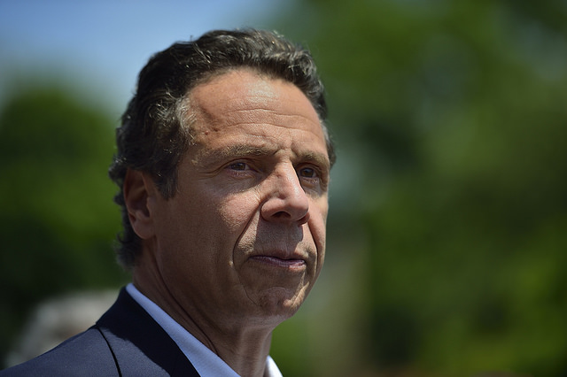
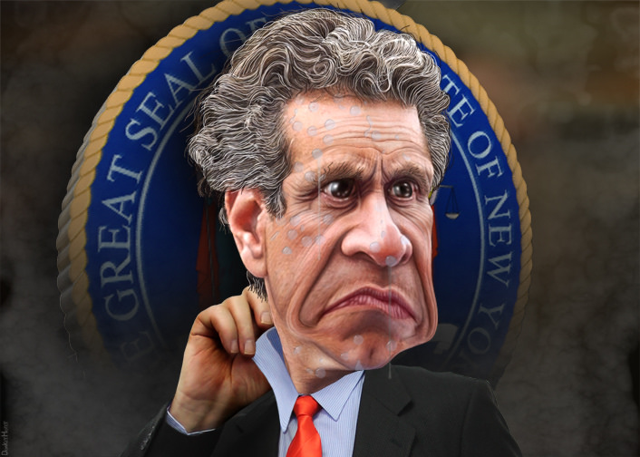

_This is a Public Service Announcement, sponsored by Joe Mags and the good folks at The High Screen. My name is Taylor Pangman._

Every student that comes and goes from American high school learns to associate Franklin Delano Roosevelt with the New Deal. Some of us might have initially associated the New Deal with Theodore Roosevelt — an honest mistake at that age; tests are hard. Aside from the obvious connection these two former U.S. Presidents share by way of their surnames, both F.D.R. and Teddy are noted in history as being champions of social progress.

Theodore Roosevelt, whose last term as president ended in 1909, created the Progressive Party, after his prior affiliation, the GOP, became increasingly conservative under William Howard Taft’s presidency. At the Progressive National Convention in 1912, the party asserted that their mission was [“To destroy \[the\] invisible government, to dissolve the unholy alliance between corrupt business and corrupt politics.”](http://en.wikipedia.org/wiki/1912_Progressive_National_Convention#cite_note-5)

F.D.R.’s political goals as president played out like a continuation of the Progressive Party’s mission. Membership in Labor Unions increased. And despite the fears — or fear mongering, perhaps — of the conservative Right, which believed the national economy would shrivel as a result of an increased number of workers in Labor Unions, the opposite effect occurred: [the national economy increased in direct relation to the growth of the unions.](http://www.nextnewdeal.net/fdrs-championing-labor-unions-key-prosperous-post-war-economy)

This all tastes a lot like a history lesson.If you were like me as a high school student, you might remember absorbing this information about Labor Unions, and the struggle that existed between workers and big business, and between the people and their government, as something from a foreign past — one that existed, but which was no longer relevant.I am not sure who generated the inaccurate perception that the history we learn in a classroom is somehow detached from the living present. (Perhaps it was my own adolescent ignorance of the realities surrounding me that shaped this idea.) But I think it would be a sound pedagogical strategy for history teachers to relentlessly reinforce the connection between what happened in the past and what's happening now. At our present moment, it feels as if many significant current events are racing by the people, with vampiric stealth.

Fortunately, the critical significance of New York State Governor Andrew Cuomo’s proposed education reformation is not going unremarked upon by teachers, parents, students and the local presses in communities across New York State. To say that Gov. Cuomo is at odds with the New York State United Teachers would be an understatement.

NYSUT is the largest professional union in New York State.It advocates for more than [600,000 teachers, school related professionals and professionals in higher education.](http://www.nysut.org/)NYSUT is responsible for acquiring the resources that school districts need from the government of NYS. In each year that Cuomo has been Governor, his budgets have failed to provide adequate funding for school districts; his negligence to provide school districts with proper funding is a legitimate and understandable failure. 

Since the early part of the second millennium, the U.S. has been enduring a persistent economic depression. American businesses, in particular, have been rethinking what they need to do in order to thrive in an increasingly global marketplace.NYS has not been untouched by these factors.In fact, it has been taking a beating.NYS taxes are among the highest of any in the contiguous United States, and the enormous amount of funding required by public schools stands as a critical reason why. To meet the monetary needs of public schools, the NYS government must raise taxes. While businesses located in the Empire State that do not wish to pay higher taxes have the option to relocate elsewhere, if this happened, money from the private sector would not be available to tax at all — the NYS economy would fail, and there would be no money in New York with which to fund public schools.

The present tension between NYSUT and Gov. Cuomo is an example of the precise type of scenario that labor unions were formed to confront. Gov. Cuomo is not at fault for attempting to keep private businesses in New York; he would be guilty of lacking foresight if he was not. And NYSUT is fulfilling its purpose by vigilantly seeking state funding for the students, teachers and schools it represents. Some sort of compromise between NYSUT and Gov. Cuomo would be a symbiotic resolution for both parties. 

That Gov. Cuomo does not seem interested in compromising with NYSUT, now this is where we can find fault in him.

\[caption id="attachment\_2698" align="alignright" width="640"\] Andrew Cuomo. (Photo provided by Diana Robinson)\[/caption\]

On Friday, Feb. 27, I was granted an opportunity to talk with Carl Korn, NYSUT’s Press Secretary for Public Relations, about Gov. Cuomo’s education reforms. We talked in the morning over the phone.The day was warmer than the rest of the month had been; February — this winter, really — has been particularly harsh.The vivid sun, rising toward the afternoon, graciously complimented Korn's impassioned voice.

One of the first questions I asked Carl had to do with an article I had found in the Observer. Unlike most of the articles I had found concerning Gov. Cuomo and education, this piece [depicted a rally that had taken place in support of Gov. Cuomo’s reforms](http://observer.com/2015/02/parents-rally-in-support-of-gov-cuomos-education-reforms/). The rally, which took place at Medgar Evers College in Brooklyn, featured parents and students who believe the Governor's new standards for evaluating teacher effectiveness are both adequate and overdue. The opinion of these particular families stands in stark contrast to the consensus from parents, teachers and researchers who are familiar with Gov. Cuomo’s proposed policies. 

Valerie Strauss outlines [the details of Gov. Cuomo’s education reforms](http://www.washingtonpost.com/blogs/answer-sheet/wp/2015/01/27/n-y-teachers-bash-gov-cuomo-your-reform-plans-are-extremely-damaging/) for The Washington Post. Part of Gov. Cuomo’s proposed plan is to, “Require that student standardized test scores account for a full 50 percent of a teacher’s evaluation rather than the current 20 percent.” Further, Gov. Cuomo wants to, “Deny an ‘effective’ rating to any teacher who is rated ‘ineffective’ based on test scores, and award bonuses of up to $20,000 to teachers who are ‘highly effective’ (thanks to test scores of their students).” This is a ludicrous proposition. Student standardized test scores are not effective or reliable indicators of a student’s ability to learn, or of a teacher’s ability to instruct. As Korn puts it, “To take a year of a teacher’s work and base it on one test is insane.” The overemphasis placed on student standardized test scores, and by Gov. Cuomo’s proposed education reforms, will not help to determine a teacher’s effectiveness in the classroom.

The parents rallying in support of Gov. Cuomo’s proposed education reforms at Medgar Evers are misguided. They are not wrong to want ineffective teachers dismissed from their student’s classrooms, but the Governor’s criteria for judging a teacher effective or ineffective is insufficient. By the Governor’s standards, a teacher who has otherwise been effective throughout the school year can be deemed ineffective on the basis of one test. The traditional perspective on education states that teachers are a light for students to follow. Gov. Cuomo's reform plan would put the future of teachers at the mercy of their students's success — not over the duration of the year, but on a single exam. This may not exactly be a role reversal, but it is just as ridiculous.  

“Parents are not bamboozled by the Governor’s rhetoric,” Carl told me. Rhetoric is the device that Gov. Cuomo is employing when he posits public education as a failing system. Low income communities across NYS — such as the communities of Crown Heights and Jamaica, Queens, the ones represented by parents at Medgar Evers College — do not need the Governor’s education reforms. What they need is state funding. Higher taxes are necessary, however, to provide low income communities with the proper amount of state funding. At this time, NYS can not afford to raise taxes on businesses in the state, because these businesses might choose to leave New York, and move to a state with lower taxes. _(Camera snaps to Pennsylvania, wearing a clean, white bib, clenching a knife and fork in either hand.)_ The result of this would be catastrophic to NYS.

Perhaps Gov. Cuomo believes that private education, through a charter school system, offers him an alternative to raising taxes on businesses, while also providing NYS with an adequate education system. Rather than acknowledge the scale on which he must balance the counter-weighted interests of public education and businesses in NYS, the Governor has chosen to veil this dilemma behind a vociferous rhetoric — one that denounces NYSUT. Rather than be forthright about this predicament, the Governor has opted to remain opaque to the public. His recent aggression toward NYSUT indicates that he has placed his weight on the side of keeping businesses in NYS, and against the interests of public education.

According to Gov. Cuomo, any failure of public schools is attributable to teachers, not to a lack of state funding. This is the rhetoric that moved parents to show their support for the Governor’s education reforms at Medgar Evers. _Public schools are failing because public school teachers are not being evaluated correctly._

This is not true, but this is the Governor’s rhetoric.

\[caption id="attachment\_2699" align="aligncenter" width="706"\] Caricature: Andrew Cuomo worried about the future. (Art provided by DonkeyHotey)\[/caption\]

I mentioned before that the mission statement of the Progressive National Convention was: “To destroy \[the\] invisible government, to dissolve the unholy alliance between corrupt business and corrupt politics.” Gov. Cuomo’s alliance of state interests with business interests is reminiscent to the invisible government that the Progressive Party stood in opposition against. When business interests threaten to dismantle the citadel that public education strives to construct for the people, then opposition to the goals of private business must once again be established. Behind the Governor’s rhetoric, which condemns teachers, NYSUT and public education, there is a labor struggle unfolding.

Valerie Strauss begins her article by providing three reasons why Gov. Cuomo would ignore the position of the American Statistics Association on how not to use statistics to evaluate teachers; that is, why we should not base the effectiveness of a teacher on a single test. These three reasons are (1) He doesn’t know the organization’s position, (2) he knows, but he does not understand it or (3) he knows _and_ understands it, but he thinks he knows better. I asked Korn if there might be another reason why Gov. Cuomo would ignore the position of the American Statistics Association.

“Gov. Cuomo should stop playing political games at the expense of NYS students,” Carl said. 

The political game that Korn is referring to is of political retribution. NYSUT supported Cuomo’s bid when he first ran for Governor, however, NYSUT removed its support for Gov. Cuomo when he ran for reelection, after the labor union saw that he did not provide for their interests. “You can count on one hand the number of times the Governor has visited public schools,” Carl said.

Throughout his tenure, Gov. Cuomo has displayed a pattern of disrespect, dismissal and contempt toward public education. The fourth reason that I will offer for why Gov. Cuomo continues to ignore the authority of the ASA is that he has found an alternative in private education, through charter schools, to raising taxes on NYS businesses.

Korn was undecided on that front. “It’s hard to tell if \[Gov. Cuomo\] is misinformed, or if this is a deliberate attempt to undermine public education in NYS... NYS teachers are excellent. The worst way to attract young teachers to the profession is to do what he’s doing.” His advice to Gov. Cuomo was to quit his political games, and to “visit public schools. Address the concerns of teachers, parents and students — take the time to learn.”

It may be more difficult for Gov. Cuomo to leave his political games behind than we the people might hope. Gov. Cuomo is caught in a bind between private and public interests. In turn, the interests of private businesses in NYS are engaged in tenacious competition with the forces of a global economy. The forces of this global economy perhaps comprise the invisible government that the Progressive Party and later F.D.R had defended the American worker against. This invisible government has the power to move nations. Always, everywhere, we are forced to appease the corporation. Consider the [outrageous prices on, say, lattes](https://www.youtube.com/watch?v=KTX4DPN8DEE), in relation to minimum wage. Consider the debts accrued by college students across the country in exchange for higher education. 

There is a possible narrative that characterizes Gov. Cuomo as a democratic lion, attempting to balance the whims of big business and the needs of public education. And there is an alternative narrative that dangles Gov. Cuomo as a puppet for big business. This contradiction reflects those that have plagued Barrack Obama's presidency.  The American people are weary of President Obama because, despite his beautiful rhetoric — which sprawls like the Appalachians, flows like the Mississippi and hits like tumbleweed at the bottom of a dust bowl — we don't actually get to know whose side he is on.

With increasing ferocity, the interests of big business are suffocating the American people. There is not a better example of this than the effects that Gov. Cuomo's education reforms will have on NYS, if they are upheld.  An uneducated population, devoid of opportunities for social movement, and unable — or _unwilling_ (due to fear) — to do anything but what they are told, is the ideal legion of people to fuel the corporate work force. [The line it is drawn, the curse it is cast](https://www.youtube.com/watch?v=e7qQ6_RV4VQ) — The corporation is not motivated by the best interests of the people. Rather, it will attempt to eclipse reality, and determine interest through product advertisements and corporate funded political campaigns — this is subliminal, drone warfare. If you do not like this metaphor, then recognize it as propaganda, at least.     

Gov. Cuomo has utilized force and intimidation to impose the will of the corporation on NYS education. I believe he might have fallen victim to the arrogant, belittling and ultimately false cliche that states: "Those who do not know, teach." He might have expected NYS teachers to wither like lilies before the fall, but they have sounded their horn like thunder.

https://www.youtube.com/watch?v=KTX4DPN8DEE

Let's talk briefly about something called the latte dilemma. Desire for a corporate product is manufactured. Our bodies have no biological necessity for lattes, but the success of Starbucks starts with the creation of a desire for lattes, which — as chemical dependency kicks in — begins to feel like a need. This is addiction: The subtle, seemingly unpredicted transition from desire to need. And when the desire that becomes need was not present in a subject to begin with, then real artistry is being crafted: The creation of something from nothing.

Gov. Cuomo is attempting to transpose the desire of the corporation onto the people of NYS by presenting his education reforms as a plan that will serve the people's best interests — as something we need. Through the rhetoric of politicians, the needs of the people are being convoluted by the desires of the corporate machine. The latte dilemma is a value dilemma. It asks us to assess our values, and to determine what conditions must have preexisted in order for us to value what we do.

As far as the future of public education is concerned, can we allow ourselves the luxury of appeasing corporate interests in NYS? If we sit back and let NYSUT collapse — the state's largest professional union — what relationship to private business do we consent, through our failure to defend public education, to being subjected to? Think back to the time you spent in primary and secondary school; what chalk marks were never erased from your mind?

_Now, back to our regular scheduled programming_.

