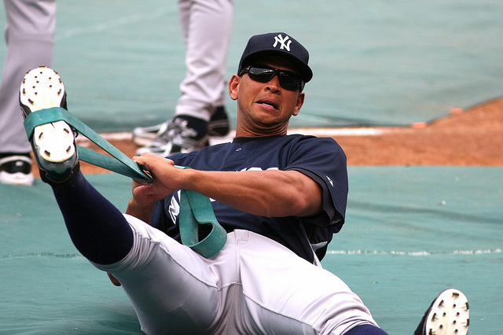

_(The High Screen is running a novice’s guide to advanced statistical analysis in sports in the form of a 10-part series[. Part I](http://www.thehighscreen.com/2015/02/novices-guide-advanced-stats/) was an introduction to the series. [Part II](http://www.thehighscreen.com/2015/02/novices-guide-advanced-stats-part-ii-baseball/) covered Baseball. [Part III](http://www.thehighscreen.com/2015/02/novices-guide-advanced-stats-part-three-basketball/) covered basketball. [Part IV](http://www.thehighscreen.com/2015/02/novices-guide-advanced-stats-part-iv-hockey/) covered hockey. Part V was a [Q+A with Matthew Coller](http://www.thehighscreen.com/2015/03/novices-guide-advanced-stats-part-v-qa-matthew-coller/). Part VI covered [American Football ](http://www.thehighscreen.com/2015/03/the-novices-guide-to-advanced-stats-part-vi-american-football/). Part VII covered the [Calgary Flames](http://www.thehighscreen.com/2015/03/the-novices-guide-to-advanced-stats-part-vii-the-calgary-flames/). [Part VIII](http://www.thehighscreen.com/2015/04/the-novices-guide-to-advanced-stats-part-eight-interview-with-rob-vollman/) was a Q+A with Rob Vollman. [Part IX](http://www.thehighscreen.com/2015/04/the-novices-guide-to-advanced-stats-part-ix-addressing-some-common-concerns/) addressed some common concerns involving advanced stats.)_

So, this will be the last post of the advanced stats series. To all those who have read every piece, thank you and I hope you’ve gained something from them.

As a final topic, I’d like to cover a practical way advanced stats can be used to address a prevalent and current issue. After all, that was the point of all of this.

Alex Rodriguez has been making headlines since he entered Major League Baseball more than 20 years ago. Many of these headlines have been negative, but lately, those headlines have been a bit more positive. Entering a season where he’ll turn 40 in July and after a year-long suspension in 2014, most people didn’t expect much of A-Rod at the plate in 2015.

Through 16 games, though, he’s made his doubters look stupid, as he’s sporting a batting line of .265/.419/.571 (that’s batting average/on-base percentage/slugging). He has four home runs already and has been a bright spot for a below-average Yankee offense.

If he can keep it up, this would be one of the more unlikely comeback stories in recent history. After tearing through one of the greatest extended stretches of hitting in baseball history from 1996 to 2007, Rodriguez signed the now infamous 10-year, $275 contract extension with the Yankees. Although he remained productive from 2008 through 2012, he struggled with injuries every season. He missed a total of 190 games for an average of 38 per season. Before the 2013 season, he suffered a major hip injury that threatened to cost him the entire season.

He eventually recovered, but by that time more trouble had surfaced. He had been named a culprit in the [“Biogenesis” scandal](http://www.theguardian.com/sport/2013/aug/02/biogenesis-peds-scandal-explained) and was suspended 211 games — which left him out of the lineup until this month. He appealed the suspension and the decision was moved until after the season, allowing him to play the final two months. He started off well enough, but he skidded to the finish putting up his worst numbers since he was a teenager. After the season, the ruling came down that his suspension had been reduced to 162 games. He’d miss the entire 2014 season.

Considering all that and his advanced age, we’re looking at a hell of a comeback story. The question remains: can he keep it up?

\[caption id="attachment\_2752" align="aligncenter" width="640"\] (Photo by Keith Allison)\[/caption\]

Since A-Rod isn’t playing defense (he’s been used mostly as a designated hitter) or swiping bases, the vast majority of his value comes at the plate, meaning contact, power and patience are mostly responsible for his success.

A-Rod’s .265 batting average is better than his 2013 campaign but worse than every full season of his career. Again, that’s to be expected at his age. A good way to tell if a batting average is likely to regress is to check out that player’s batting average on balls in play (BABIP). BABIP’s tend to stay consistent throughout a player’s career (or at least that player’s prime). So if a BABIP is higher than usual, it will likely tumble down eventually, bring batting average down with it. This year, Rodriguez is sporting a .321 BABIP, up a minuscule amount of his .318 career average. While he may be due for some negative regression in this department, it will likely be very minor.

Rodriguez’s .419 on-base percentage stands out perhaps more than anything this year. It’s driven by his absurdly-high walk rate at the moment. He’s walking in 21 percent of his at bats which is nearly double his career rate of 11 percent. While it’s easier to become more patient at the plate than become a better hitter, this time of jump over the course of a full season is unprecedented, likely making unsustainable.

But, looking at his season-by-season walk rates, it’s clear A-Rod has become more patient over the years. He failed to reach a 10 percent walk rate in each of his first six seasons, but hit at least that high in all but two seasons after that, hitting at least 12 percent seven times. It’s also possible he’s realized he is no longer capable of being one of the league’s best power hitters and has decided to make up for it by focusing on working counts and getting walks.

Considering his peak walk percentage was 15 percent, however, he’s going to see some negative regression in that department no matter what. But if he’s able to bat around .260 and walk about 12 percent of the time, he’ll have far surpassed expectation.

The only question that remains is what to expect from him in the power department. His slugging percentage of .571 is the highest he’s posted since 2008. A quick look at [Fangraph’s batted ball’s statistics](http://www.fangraphs.com/statss.aspx?playerid=1274&position=3B/SS#advanced) show that either A-Rod has taken a vastly-different approach at the plate in 2015, or his power statistics have been skewed by some early-season wonkiness. Whereas he generally hits 1.08 ground balls for every fly ball, this year he’s hitting .47 ground balls for every fly ball.

Not only is he hitting more fly balls, they’re going out of the park at a higher rate. So far, about 23.5 percent of his fly balls have gone for home runs. In the past four seasons, they went out at rates of 17.1 percent, 14.5 percent, 15.8 percent and 15.6 percent. This could be due to a variety of factors – playing more in hitter-friendly parks or just luck – but it certainly isn’t sustainable.

A-Rod’s slugging dropped every year from 2007 to 2013. It’s highly-unlikely he’ll turn that around this year. Expect him to end up in the low-to-mid .400 range, where he’s been since 2011.

So, it appears we have a nuanced answer to the original question. No, this is not sustainable. A-Rod will likely see dips in both his walk rate and his slugging percentage which should impact his overall value.

Still, he’ll be better than expected. It seems like he’ll be able to maintain an .800 OPS (on-base plus slugging), which is much better than many anticipated.

And, after 20 months of being the [whipping boy](http://espn.go.com/new-york/mlb/story/_/id/11827107/new-york-yankees-alex-rodriguez-bother-apologizing-ped-use) for [baseball purists](http://sports.yahoo.com/news/yankees-star-alex-rodriguez-joins-lance-armstrong-as-a-titan-of-sports-disgrace-193848038.html) and a [scapegoat](http://m.mlb.com/news/article/66433260/arbitrator-rules-alex-rodriguez-to-be-suspended-for-2014-season) for former Commissioner Bud Selig’s [utter negligence](http://www.latimes.com/sports/la-sp-mlb-drugs-shaikin-20140806-story.html) during the Steroid Era, A-Rod is having a more-than-solid season at an age where most players have long-since retired.

He won’t have a plaque waiting for him at Cooperstown in the future, but he damn well should.

